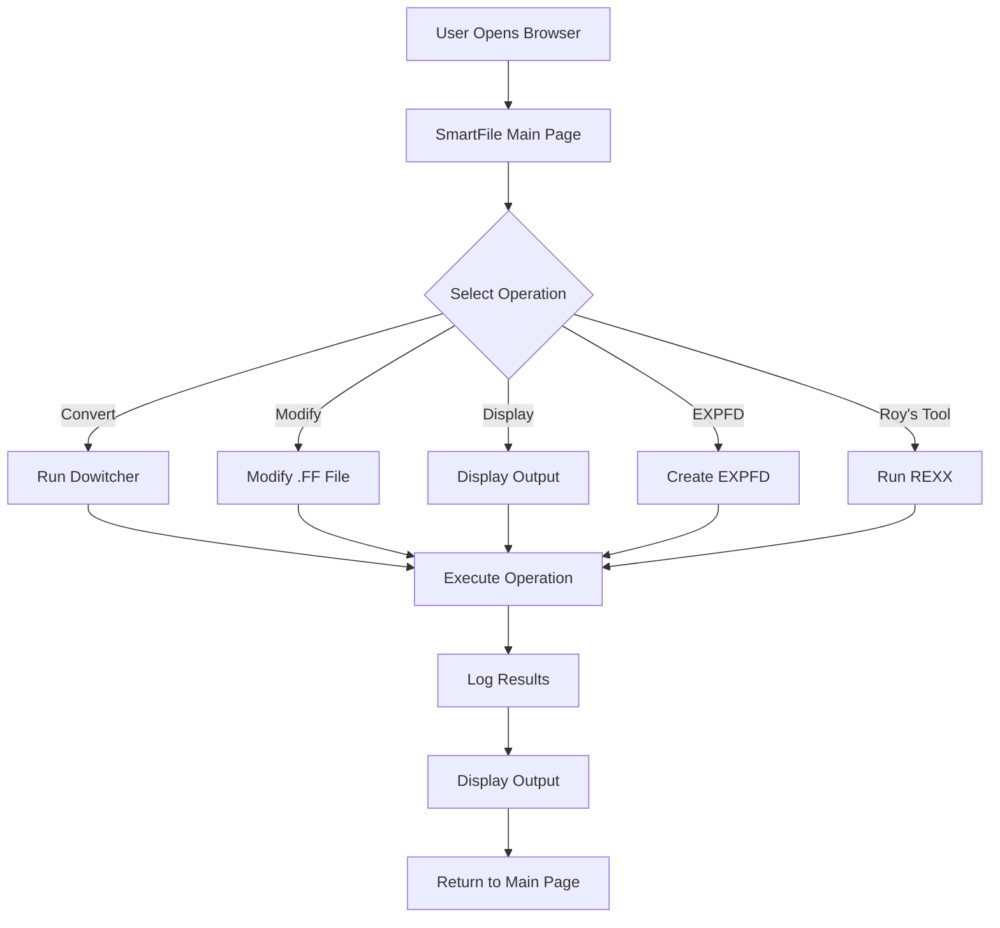

# SmartFile Converter

[](https://github.com/astadia/smartfile)
[](https://www.microsoft.com/windows)

**SmartFile Converter** is a powerful web-based application designed to simplify mainframe file conversion and format file management. Built with Flask and designed for ease of use, SmartFile Converter provides an intuitive interface for handling EBCDIC to ASCII conversions, format file modifications, and EXPFD creation.

---

## 🌟 Features

### Core Functionality
- **🔄 Dowitcher Integration** - Convert EBCDIC files to ASCII using format definitions
- **🏷️ File Renaming** - Rename format files (.ff) with validation
- **✏️ File Modification** - Modify format file structures with custom conditions
- **📝 EXPFD Creation** - Convert copybook files to EXPFD format
- **🔧 Roy's EBCDIC Tool** - Advanced EBCDIC record type processing
- **🔄 DataTurn Processing** - Automated DataTurn workflow execution
- **👁️ Display Tools** - View converted output with optional hex display
- **📋 Record Selection** - Convert specific record ranges
- **⚙️ Path Management** - Update application paths dynamically
- **📋 Real-time Logging** - Comprehensive activity logging with live viewing

### User Experience
- Modern, responsive web interface with gradient design
- Real-time operation feedback
- Color-coded output messages
- Resizable output panels
- Detailed operation logs
- No technical knowledge required

---

## 📋 Table of Contents

- [System Requirements](#-system-requirements)
- [Installation](#-installation)
- [Quick Start](#-quick-start)
- [Configuration](#-configuration)
- [Usage](#-usage)
- [Architecture](#-architecture)
- [Building the Executable](#-building-the-executable)
- [Troubleshooting](#-troubleshooting)
- [Support](#-support)

---

## 💻 System Requirements

### Minimum Requirements
- **Operating System:** Windows 10 or later (64-bit)
- **RAM:** 4 GB minimum, 8 GB recommended
- **Disk Space:** 500 MB for application, additional space for data processing
- **Browser:** Modern web browser (Chrome, Firefox, Edge)
- **Python:** 3.8 or later (for development/source version)

### Required Dependencies
- **dowitcher.exe** - File conversion utility (required)
- **rexx.exe** - REXX interpreter for Roy's tool (required for EBCDIC processing)
- **DataTurn** - Optional, required for DataTurn operations
- **File_modify.py** - Required for .ff file modification

---

## 📦 Installation

### Option 1: Standalone Executable (Recommended for End Users)

1. **Download** the `SmartFile_Converter.exe` file
2. **Place** it in your preferred directory (e.g., `C:\File_conversion\`)
3. **Ensure required files** are in the same directory:
   - `dowitcher.exe`
   - `rexx.exe`
   - `File_modify.py`
   - `RoysEbcdicRecTypesV6.rexx`
   - `path.txt`
4. **Double-click** to run - no installation needed!

### Option 2: From Source (For Developers)

```bash
# Navigate to the project directory
cd C:\File_conversion

# Install required packages
pip install flask

# Run the application
python file.py
```

### Required Python Packages
```
Flask>=2.3.0
```

---

## 🚀 Quick Start

### Running the Application

#### Using the Executable
```bash
# Navigate to the directory
cd C:\File_conversion

# Run the application
SmartFile_Converter.exe

# When prompted, press Enter to use default port (5000)
# Or enter a custom port number
```

#### Using Python
```bash
python file.py
```

### First-Time Setup

1. **Start the application** - Your browser will open automatically to `http://localhost:5000`
2. **Verify configuration** - Check that `path.txt` has correct paths
3. **Update paths if needed** - Click "Update Paths" to modify configuration
4. **You're ready!** - Start using the conversion tools

---

## ⚙️ Configuration

### Configuration File: `path.txt`

Located in the application directory, contains all essential paths:

```ini
# File Paths
FORMAT_PATH=C:/File_conversion/occ/FF_FILES/datamig/file-format
INPUT_PATH=C:/File_conversion/occ/input
OUTPUT_PATH=C:/File_conversion/occ/output
LOG_PATH=C:/File_conversion/logs

# Data Match Directories
target=C:/File_conversion/occ/datamatch/target
source=C:/File_conversion/occ/datamatch/source

# Additional Paths
CSV_file=C:/File_conversion/occ.csv
copybook=C:/File_conversion/occ/copybook
expfd=C:/File_conversion/occ/expfd
application=C:/File_conversion/occ
all_file=paths
```

### Path Configuration Explained

- **FORMAT_PATH**: Directory containing format files (.ff)
- **INPUT_PATH**: Directory with source EBCDIC files (.txt)
- **OUTPUT_PATH**: Directory where converted files are saved
- **LOG_PATH**: Directory for application logs
- **source**: Source files for data matching
- **target**: Target files for data matching
- **copybook**: Copybook definition files
- **expfd**: EXPFD output files
- **application**: Application base directory

### Updating Paths

**Via Web Interface:**
1. Click **Update Paths** button
2. Enter new **Application Name**
3. Click **Update All Paths**
4. All paths will be updated automatically

**Manual Editing:**
1. Open `path.txt` in a text editor
2. Update the values (use forward slashes `/`)
3. Save the file
4. Restart SmartFile Converter

---

## 📖 Usage

### Feature Walkthroughs

#### 1. Run Dowitcher (Convert to ASCII) ⚙️

Converts EBCDIC files to ASCII format using format definitions.

**Prerequisites:**
- Format file (.ff) must exist in FORMAT_PATH
- Input file (.txt) must exist in INPUT_PATH
- dowitcher.exe must be available

**Steps:**
1. Enter **File name** (without .ff extension)
2. Click **Run Dowitcher**
3. Wait for conversion to complete
4. Check OUTPUT_PATH for converted file

**What happens:**
- Reads the .ff format file
- Converts EBCDIC input to ASCII
- Saves output to OUTPUT_PATH
- Copies files to source/target for comparison

---

#### 2. Rename .FF File 🏷️

Renames format files with validation and override capability.

**Steps:**
1. Enter **File name** (the current .ff file name)
2. Click **Rename .FF File**
3. On the rename page, select the file to rename
4. Enter the **New name** (without .ff)
5. Click **Rename File**

**Features:**
- Lists all .ff files in FORMAT_PATH
- Override mode: Replaces existing files
- Automatic .ff extension
- Validation to prevent errors

---

#### 3. Modify .FF File ✏️

Modifies format file structure using File_modify.py.

**Prerequisites:**
- File_modify.py must be in the application directory
- Format file must exist

**Steps:**
1. Enter **File name** (without .ff)
2. Click **Modify .FF File**
3. Select **File Type** from dropdown
4. Select **Condition Type**
5. Click **Modify File**

**File Types:**
- F (Fixed)
- V (Variable)
- FB (Fixed Blocked)
- VB (Variable Blocked)

**Condition Types:**
- Various condition patterns supported by File_modify.py

---

#### 4. Create EXPFD 📝

Converts copybook files to EXPFD format.

**Prerequisites:**
- Copybook files must be in the copybook directory
- Copybook path configured in path.txt

**Steps:**
1. Enter **Copybook name** (without extension)
2. Click **Create EXPFD**
3. EXPFD file will be created in expfd directory

**What it does:**
- Reads copybook file
- Processes record structures
- Generates EXPFD format
- Saves to expfd directory

---

#### 5. Run DataTurn 🔄

Executes DataTurn processing workflow.

**Prerequisites:**
- DataTurn must be installed
- EXPFD files must exist
- DataTurn path configured

**Steps:**
1. Enter **EXPFD name** (without extension)
2. Click **Run DataTurn**
3. Wait for processing to complete
4. Check output directory for results

---

#### 6. Run Roy's Tool 🔧

Advanced EBCDIC record type processing using REXX.

**Prerequisites:**
- rexx.exe must be available
- RoysEbcdicRecTypesV6.rexx must exist
- Input file must be in INPUT_PATH

**Steps:**
1. Enter **File name** (without .txt)
2. Click **Run Roy's Tool**
3. Enter parameters:
   - **Record Format**: F (Fixed) or V (Variable)
   - **Record Length**: Numeric value
   - **Key Beginning Position**: Numeric offset
   - **Key PIC Clause**: COBOL PIC clause
   - **RDW Flag**: Check if variable with RDW
4. Click **Execute**

**Example Parameters:**
- Record Format: `F`
- Record Length: `80`
- Key Begin Position: `1`
- Key PIC: `X(10)`

---

#### 7. Display Output 👁️

Views converted output files in readable format.

**Steps:**
1. Enter **File name** (without .ff)
2. Optional: Enter **Records** (e.g., 1-100 or 5)
3. Click **Display Output**
4. View formatted output

---

#### 8. Display with Hex 🔢

Views output with hexadecimal representation.

**Steps:**
1. Enter **File name**
2. Optional: Enter **Records**
3. Click **Display with Hex**
4. View output with hex values

---

#### 9. Convert Particular Records 📋

Converts only specified record ranges.

**Steps:**
1. Enter **File name**
2. Enter **Records** (required - e.g., 1-50 or 10)
3. Click **Convert Records**
4. Only specified records will be converted

---

#### 10. Input Display with Hex 💾

Views input file with hex formatting and field information.

**Steps:**
1. Enter **File name**
2. Optional: Enter **Records**
3. Click **Input with Hex**
4. View input with:
   - Hex values
   - Field numbers
   - Field offsets

---

#### 11. View Logs 📋

Displays comprehensive operation logs.

**Features:**
- Real-time log updates
- Color-coded messages
- Last 10,000 log entries
- Scroll controls

**Steps:**
1. Click **View Logs**
2. Use controls:
   - **⬆️ Top** - Jump to start
   - **⬇️ Bottom** - Jump to end
   - **📋 Copy All** - Copy logs
   - **🔄 Refresh** - Reload logs

---

## 🏗️ Architecture

### Technology Stack

- **Backend:** Flask (Python)
- **Frontend:** HTML5, CSS3, JavaScript
- **Logging:** Python logging module with file handlers
- **File Operations:** Python standard library (os, shutil)
- **Subprocess Management:** Python subprocess module
- **External Tools:** dowitcher.exe, rexx.exe, DataTurn

### Project Structure

```
SmartFile_Converter/
├── file.py                        # Main Flask application (4157 lines)
├── path.txt                       # Core path configuration
├── dowitcher.exe                  # Conversion utility
├── rexx.exe                       # REXX interpreter
├── File_modify.py                 # .ff file modifier
├── RoysEbcdicRecTypesV6.rexx     # Roy's EBCDIC tool
├── SmartFile_Converter_README.md  # This file
├── SmartFile_Converter_USER_GUIDE.md  # User documentation
└── logs/                          # Application logs
    └── SmartFile_Converter_YYYYMMDD.log
```

### Application Flow



### Logging System

- **File-based logging** with automatic rotation
- **Timestamp-based** log files: `SmartFile_Converter_YYYYMMDD.log`
- **Structured log entries** with operation details
- **HTML-safe** log storage for web display
- **Immediate flushing** for real-time updates

---

## 🔨 Building the Executable

### Using PyInstaller

SmartFile Converter can be compiled into a standalone executable:

#### Prerequisites
```bash
pip install pyinstaller
```

#### Build Command
```bash
pyinstaller --onefile --name SmartFile_Converter file.py
```

#### Advanced Build with Data Files
```bash
pyinstaller --onefile ^
  --name SmartFile_Converter ^
  --add-data "path.txt;." ^
  --add-data "File_modify.py;." ^
  --add-data "RoysEbcdicRecTypesV6.rexx;." ^
  --add-binary "dowitcher.exe;." ^
  --add-binary "rexx.exe;." ^
  file.py
```

#### Build Options Explained
- `--onefile` - Creates a single executable file
- `--name SmartFile_Converter` - Names the output executable
- `--add-data` - Includes required Python scripts
- `--add-binary` - Includes required executables
- `--noconsole` - Optional: hides console window

#### Build Output
The executable will be created in the `dist/` folder:
```
dist/
└── SmartFile_Converter.exe
```

### Distribution Package

Create a distribution package with:

```
SmartFile_Converter_Distribution/
├── SmartFile_Converter.exe
├── path.txt
├── dowitcher.exe
├── rexx.exe
├── File_modify.py
├── RoysEbcdicRecTypesV6.rexx
├── SmartFile_Converter_USER_GUIDE.md
└── SmartFile_Converter_README.md
```

---

## 🐛 Troubleshooting

### Common Issues

#### Issue: Application won't start
**Symptoms:** SmartFile_Converter.exe doesn't launch or crashes

**Solutions:**
- Check if port 5000 is already in use
- Try specifying a different port
- Run as Administrator
- Check antivirus isn't blocking the application
- Verify all required files are present

---

#### Issue: "dowitcher.exe not found"
**Symptoms:** Operations fail with missing executable error

**Solutions:**
- Verify dowitcher.exe is in the same directory as SmartFile_Converter.exe
- Check file permissions
- Try running dowitcher.exe manually to test
- Ensure the file isn't blocked by Windows (Right-click → Properties → Unblock)

---

#### Issue: "rexx.exe not found"
**Symptoms:** Roy's Tool fails to execute

**Solutions:**
- Verify rexx.exe is in the application directory
- Check that RoysEbcdicRecTypesV6.rexx exists
- Test rexx.exe manually from command prompt
- Ensure proper file permissions

---

#### Issue: "File not found" errors
**Symptoms:** Operations fail with file path errors

**Solutions:**
- Verify all paths in path.txt are correct
- Use forward slashes (/) in paths, not backslashes (\)
- Ensure files exist at specified locations
- Check file permissions and access rights
- Use Update Paths to reconfigure

---

#### Issue: Format file (.ff) not found
**Symptoms:** Dowitcher fails with missing .ff file

**Solutions:**
- Check FORMAT_PATH in path.txt
- Verify the .ff file exists in the format directory
- Ensure file name matches exactly (case-sensitive)
- Create or rename the format file if needed

---

#### Issue: File_modify.py fails
**Symptoms:** Modify operation returns errors

**Solutions:**
- Verify File_modify.py is in the application directory
- Check Python is installed and accessible
- Review the error message in logs
- Ensure the format file exists

---

#### Issue: DataTurn not working
**Symptoms:** DataTurn operations fail

**Solutions:**
- Verify DataTurn is installed
- Check DataTurn executable path
- Ensure EXPFD files exist
- Review DataTurn configuration
- Check DataTurn license

---

#### Issue: Browser doesn't open automatically
**Symptoms:** Application starts but no browser window

**Solutions:**
- Manually navigate to `http://localhost:5000`
- Check your default browser settings
- Try a different browser
- Check firewall settings
- Verify the port number shown in the console

---

#### Issue: Logs not updating
**Symptoms:** Log viewer shows old data

**Solutions:**
- Click the **🔄 Refresh** button
- Check if logs directory exists
- Verify write permissions to logs folder
- Restart the application
- Check for disk space issues

---

#### Issue: Conversion produces incorrect output
**Symptoms:** Output file has wrong data

**Solutions:**
- Verify the format file (.ff) is correct
- Check input file encoding (should be EBCDIC)
- Review dowitcher command in logs
- Test with a small sample first
- Verify code page setting (CP0037)

---

### Debug Mode

To run in debug mode for troubleshooting:

1. If using source, edit `file.py`:
```python
# Find the line at the end:
app.run(debug=False, port=port)

# Change to:
app.run(debug=True, port=port)
```

2. Run the application
3. Check console for detailed error messages
4. Check logs directory for log files

---

## 💬 Support

### Getting Help

**For Users:**
- Consult the [SmartFile Converter User Guide](SmartFile_Converter_USER_GUIDE.md)
- Check the [Troubleshooting](#-troubleshooting) section
- Review application logs in View Logs

**For Developers:**
- Check the [Architecture](#-architecture) section
- Review inline code documentation in file.py
- Examine log files for debugging

### Contact

**Astadia Team**
- Email: support@astadia.com
- Website: https://www.astadia.com

---

## 📄 License

Copyright © 2025 Astadia Team. All rights reserved.

This software is proprietary and confidential. Unauthorized copying, distribution, or use of this software, via any medium, is strictly prohibited.

---

## 🔄 Version History

### Version 1.0 (November 2025)
- Initial release of SmartFile Converter
- 12 integrated tools for file conversion and management
- Web-based user interface with modern gradient design
- Real-time logging with immediate flush
- Dowitcher integration for EBCDIC to ASCII conversion
- Roy's EBCDIC Tool integration
- EXPFD creation from copybooks
- DataTurn workflow automation
- Format file modification and renaming
- Multiple display modes (hex, field info)
- Record-specific conversion
- Path management via web interface
- Comprehensive error handling

---

## ⚠️ Important Notes

### Security Considerations
- Application runs on localhost only (127.0.0.1)
- Not accessible from external networks by default
- Restrict access to configuration files
- Review logs regularly
- Keep sensitive data paths secure

### Performance Tips
- Process files in batches for better performance
- Monitor disk space during operations
- Close unnecessary applications during large conversions
- Use SSD storage for faster processing
- Keep input/output directories on same drive when possible

### Backup Recommendations
- Always backup source files before processing
- Keep configuration files in version control
- Regularly backup logs for audit purposes
- Maintain copies of format files (.ff)
- Test with sample data before production runs

### File Override Behavior
- SmartFile Converter operates in **override mode**
- Existing files will be replaced without warning
- Source/target folders are cleared before operations
- Renamed files replace existing files with same name
- Always maintain backups of important files

---

**SmartFile Converter - Simplifying File Conversion**

*Powered by Astadia Team*

---

*Last Updated: November 2025*  
*Version: 1.0*  
*Document Version: 1.0*
