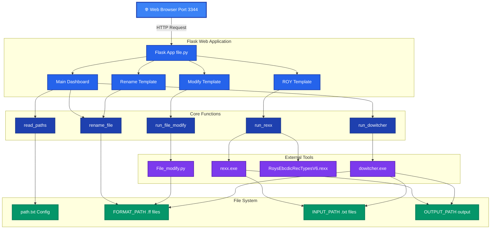

# SmartFile Converter - High-Level Architecture

## Architecture Overview

### **1. User Interface Layer** 🌐
- Web browser interface accessible on port 3344
- Clean, modern dark blue theme with professional styling
- Real-time loading indicators for all operations
- Responsive design for desktop and mobile

### **2. Flask Web Application** 🚀
- **Main Application**: Flask server handling HTTP requests
- **Route Handlers**: Manages 9 different page templates
- **Templates**: 4 main HTML templates (Home, Modify, Rename, ROY)
- **Session Management**: Handles user interactions and form submissions

### **3. Core Business Logic** ⚙️
- **read_paths()**: Parses configuration from path.txt
- **rename_file()**: Handles file renaming with retry logic
- **run_file_modify()**: Manages file modification subprocess
- **run_rexx()**: Executes REXX conversion for EBCDIC files
- **run_dowitcher()**: Main conversion engine with multiple modes

### **4. External Tools & Scripts** 🔌
- **File_modify.py**: Python script for modifying .ff file structure
- **rexx.exe**: REXX interpreter for mainframe conversion
- **RoysEbcdicRecTypesV6.rexx**: EBCDIC to ASCII conversion script
- **dowitcher.exe**: Primary conversion tool for data transformation

### **5. File System** 💾
- **Configuration**: path.txt stores all directory paths
- **FORMAT_PATH**: Stores .ff format definition files
- **INPUT_PATH**: Contains .txt input files for processing
- **OUTPUT_PATH**: Stores converted output files
- **SOURCE/TARGET**: Folders for data comparison and validation

### **6. Main Operations** 🔄
1. **Rename .FF File**: Quick file renaming functionality
2. **Modify .FF File**: Update file structure (FB/VB types)
3. **Run Dowitcher**: Execute primary conversion
4. **Display Output**: View converted data results
5. **Run Roys Tool**: EBCDIC to ASCII conversion
6. **Display with Hex**: Technical hexadecimal view
7. **Convert Records**: Specific record range conversion
8. **Input with Hex**: Hexadecimal data input
9. **Update Paths**: Configure directory locations

## Data Flow

1. **User Request** → Browser sends HTTP request to Flask
2. **Route Processing** → Flask routes request to appropriate handler
3. **Core Logic** → Business logic functions process the request
4. **External Tools** → External executables perform conversions
5. **File Operations** → Read/write operations on file system
6. **Response** → Results returned through Flask to browser

## Key Features

- ✅ **Retry Logic**: Handles file system delays (3 retries, 0.5s delay)
- ✅ **Override Mode**: Automatically overwrites existing files
- ✅ **Error Handling**: Comprehensive try-catch blocks with detailed error messages
- ✅ **Configuration Management**: Centralized path configuration
- ✅ **Multiple Conversion Modes**: Display, convert, hex view, specific records
- ✅ **File Validation**: Checks file existence before processing
- ✅ **Professional UI**: Dark theme with loading indicators and tooltips
