# ConvertFlow Studio - High-Level Architecture

```mermaid
flowchart TB
    Browser["🌐 Web Browser Port 5000"]
    
    subgraph Flask["Flask Web Application - ConvertFlow Studio"]
        App["Flask App scripts_ui.py"]
        MainDash["Main Dashboard"]
        CopyBulkPage["Copy Bulk Files Page"]
        DataTurnPage["DataTurn Page"]
        ExpfdPage["EXPFD Creation Page"]
        BulkConvPage["Bulk Conversion Page"]
        CreateFoldPage["Create Folder Page"]
        OpenFoldPage["Open Folders Page"]
        CopyS3Page["Copy to S3 Page"]
        FFMapPage["FF Mapping Page"]
        ConfigPage["Scripts Config Page"]
    end
    
    subgraph Core["Core Workflow Functions"]
        ReadConfig["read_scripts_config"]
        CopyBulkFunc["run_copy_bulk"]
        DataTurnFunc["run_dataturn"]
        ExpfdFunc["run_expfd_creation"]
        BulkConvFunc["run_bulk_conversion"]
        CreateFoldFunc["run_create_folder"]
        OpenFoldFunc["run_folder_open"]
        CopyS3Func["run_copy_s3"]
        FFMapFunc["run_ff_mapping"]
    end
    
    subgraph External["External Shell Scripts"]
        CopyBulkSh["copy_bulk.sh"]
        DataTurnSh["dataturn.sh"]
        ExpfdSh["EXPFD_creation.py"]
        BulkConvSh["Bulk_conversion.sh"]
        CreateFoldSh["Create_Folder.sh"]
        OpenFoldSh["folder_open.sh"]
        CopyS3Sh["copy_s3.sh"]
        FFMapSh["file_mapping.sh"]
    end
    
    subgraph AWS["Cloud Services"]
        S3["Amazon S3 Bucket"]
        AWSCLI["AWS CLI"]
    end
    
    subgraph Files["File System & Configuration"]
        PathConfig["path.txt"]
        ScriptsConfig["scripts_config.txt"]
        IGDFile["IGD.csv/IGD.txt"]
        
        subgraph Paths["Working Directories"]
            SourcePath["SOURCE_PATH"]
            DestPath["DEST_PATH"]
            ExpfdPath["EXPFD_PATH"]
            CopybookPath["COPYBOOK_PATH"]
            InputFile["INPUT_FILE"]
            BasePath["BASE_PATH"]
            S3Path["S3_PATH"]
        end
    end
    
    Browser -->|HTTP Request| App
    App --> MainDash
    MainDash --> CopyBulkPage
    MainDash --> DataTurnPage
    MainDash --> ExpfdPage
    MainDash --> BulkConvPage
    MainDash --> CreateFoldPage
    MainDash --> OpenFoldPage
    MainDash --> CopyS3Page
    MainDash --> FFMapPage
    MainDash --> ConfigPage
    
    CopyBulkPage --> CopyBulkFunc
    DataTurnPage --> DataTurnFunc
    ExpfdPage --> ExpfdFunc
    BulkConvPage --> BulkConvFunc
    CreateFoldPage --> CreateFoldFunc
    OpenFoldPage --> OpenFoldFunc
    CopyS3Page --> CopyS3Func
    FFMapPage --> FFMapFunc
    
    ReadConfig --> PathConfig
    ReadConfig --> ScriptsConfig
    
    CopyBulkFunc --> CopyBulkSh
    DataTurnFunc --> DataTurnSh
    ExpfdFunc --> ExpfdSh
    BulkConvFunc --> BulkConvSh
    CreateFoldFunc --> CreateFoldSh
    OpenFoldFunc --> OpenFoldSh
    CopyS3Func --> CopyS3Sh
    CopyS3Func --> AWSCLI
    FFMapFunc --> FFMapSh
    
    CopyBulkSh --> SourcePath
    CopyBulkSh --> DestPath
    CopyBulkSh --> InputFile
    DataTurnSh --> ExpfdPath
    ExpfdSh --> ExpfdPath
    ExpfdSh --> CopybookPath
    BulkConvSh --> SourcePath
    BulkConvSh --> DestPath
    CreateFoldSh --> BasePath
    OpenFoldSh --> BasePath
    CopyS3Sh --> S3Path
    FFMapSh --> IGDFile
    
    AWSCLI --> S3
    
    classDef userLayer fill:#3b82f6,stroke:#1e40af,stroke-width:3px,color:#fff
    classDef flaskLayer fill:#2563eb,stroke:#1e40af,stroke-width:2px,color:#fff
    classDef coreLayer fill:#1e40af,stroke:#1e3a8a,stroke-width:2px,color:#fff
    classDef externalLayer fill:#7c3aed,stroke:#5b21b6,stroke-width:2px,color:#fff
    classDef awsLayer fill:#ff9900,stroke:#cc7a00,stroke-width:2px,color:#fff
    classDef fileLayer fill:#059669,stroke:#047857,stroke-width:2px,color:#fff
    
    class Browser userLayer
    class App,MainDash,CopyBulkPage,DataTurnPage,ExpfdPage,BulkConvPage,CreateFoldPage,OpenFoldPage,CopyS3Page,FFMapPage,ConfigPage flaskLayer
    class ReadConfig,CopyBulkFunc,DataTurnFunc,ExpfdFunc,BulkConvFunc,CreateFoldFunc,OpenFoldFunc,CopyS3Func,FFMapFunc coreLayer
    class CopyBulkSh,DataTurnSh,ExpfdSh,BulkConvSh,CreateFoldSh,OpenFoldSh,CopyS3Sh,FFMapSh externalLayer
    class S3,AWSCLI awsLayer
    class PathConfig,ScriptsConfig,IGDFile,SourcePath,DestPath,ExpfdPath,CopybookPath,InputFile,BasePath,S3Path fileLayer
```

## Architecture Overview

### **1. User Interface Layer** 🌐
- Web browser interface accessible on port 5000
- Professional dark blue theme with modern styling
- Real-time loading indicators for all workflow operations
- Responsive dashboard design

### **2. Flask Web Application** 🚀
ConvertFlow Studio manages 10 distinct pages:
- **Main Dashboard**: Central hub with workflow navigation
- **Copy Bulk Files**: Mass file copying operations
- **DataTurn**: Data transformation workflows
- **EXPFD Creation**: Export file definition generation
- **Bulk Conversion**: Batch file conversion processing
- **Create Folder**: Directory structure setup
- **Open Folders**: Quick folder access
- **Copy to S3**: AWS cloud upload functionality
- **FF File Mapping**: File format mapping validation
- **Scripts Configuration**: System configuration management

### **3. Core Workflow Functions** ⚙️
9 main workflow functions that orchestrate operations:

- **read_scripts_config()**: Dual configuration parser (path.txt + scripts_config.txt)
- **run_copy_bulk()**: Manages bulk file copy operations from CSV input
- **run_dataturn()**: Executes data transformation workflows
- **run_expfd_creation()**: Generates EXPFD files from COBOL copybooks
- **run_bulk_conversion()**: Orchestrates batch conversion processes
- **run_create_folder()**: Creates project directory structures
- **run_folder_open()**: Opens Windows Explorer to project folders
- **run_copy_s3()**: Uploads files to Amazon S3 buckets
- **run_ff_mapping()**: Validates and maps file format definitions

### **4. External Shell Scripts** 🔌
8 shell scripts that perform the actual work:

- **copy_bulk.sh**: File copying automation script
- **dataturn.sh**: Data transformation execution
- **EXPFD_creation.py**: Python script for EXPFD generation
- **Bulk_conversion.sh**: Batch conversion orchestration
- **Create_Folder.sh**: Directory creation automation
- **folder_open.sh**: Windows Explorer integration
- **copy_s3.sh**: AWS S3 upload script
- **file_mapping.sh**: File format mapping processor

### **5. Cloud Services** ☁️
AWS Integration:
- **Amazon S3**: Cloud storage for converted files
- **AWS CLI**: Command-line interface for S3 operations
- Automated upload and sync functionality

### **6. File System & Configuration** 💾

**Configuration Files:**
- **path.txt**: Common path variables shared across both applications
- **scripts_config.txt**: Script-specific configuration overrides
- **IGD.csv/IGD.txt**: File mapping and validation data

**Working Directories:**
- **SOURCE_PATH**: Source files for processing
- **DEST_PATH**: Destination for processed files
- **EXPFD_PATH**: Export file definition storage
- **COPYBOOK_PATH**: COBOL copybook files location
- **INPUT_FILE**: CSV files with file lists
- **BASE_PATH**: Base directory for folder operations
- **S3_PATH**: Local staging for S3 uploads

## Data Flow

1. **User Request** → Browser sends HTTP request to Flask (Port 5000)
2. **Dashboard Navigation** → User selects workflow from Main Dashboard
3. **Page Rendering** → Flask renders appropriate workflow page
4. **Function Execution** → Core function processes user input
5. **Script Invocation** → Python/Shell scripts are executed
6. **File Operations** → Scripts read/write to configured directories
7. **Cloud Upload** → (Optional) AWS CLI uploads to S3
8. **Response** → Results displayed in browser with detailed output

## Key Features

- ✅ **Dual Configuration**: Merges path.txt and scripts_config.txt for flexibility
- ✅ **9 Workflow Modules**: Complete data migration pipeline
- ✅ **Shell Script Integration**: Automated execution of bash scripts
- ✅ **AWS S3 Integration**: Direct cloud upload capability
- ✅ **CSV-Driven Operations**: Bulk operations from CSV file lists
- ✅ **COBOL Copybook Processing**: EXPFD generation from mainframe files
- ✅ **Error Handling**: Comprehensive validation and error reporting
- ✅ **Real-time Output**: Live script execution output display
- ✅ **Professional UI**: Dark theme with loading spinners and status indicators
- ✅ **Windows Integration**: Direct folder opening in Explorer

## Workflow Modules Explained

### 📁 Copy Bulk Files
Reads a CSV file with source and destination filenames, copies multiple files in one operation.

### 🔄 Run DataTurn
Executes the dataturn.sh script to transform data formats using EXPFD definitions.

### 📋 Create EXPFD
Generates Export File Definitions from COBOL copybooks for data conversion.

### 🔁 Bulk Conversion
Processes entire directories of files through conversion pipeline.

### 📂 Create Folder Structure
Sets up required directory hierarchy for migration projects.

### 📁 Open Project Folders
Launches Windows Explorer to quickly access project directories.

### ☁️ Copy to AWS S3
Uploads processed files to Amazon S3 cloud storage for distribution.

### 🗺️ FF File Mapping
Validates file format definitions against IGD reference files.

### ⚙️ Scripts Configuration
Manages all path variables and configuration settings through web interface.
